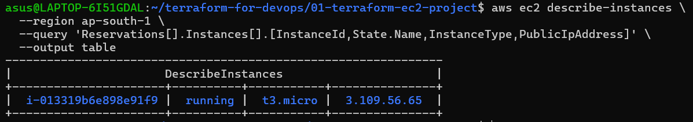

# Terraform AWS EC2 Deployment

## 📌 Project Overview

This project demonstrates how to provision an Amazon EC2 instance using **Terraform** and **HashiCorp Configuration Language (HCL)**.

The project was built using **Ubuntu/WSL**, AWS CLI, Terraform, and the AWS provider.

The main objective was to understand the complete Terraform workflow:

```text
Terraform Configuration
        ↓
terraform init
        ↓
terraform validate
        ↓
terraform plan
        ↓
terraform apply
        ↓
AWS EC2 Instance
        ↓
terraform destroy
```

---

## 🏗️ Architecture

```text
                    Ubuntu / WSL
                         │
                         │ Terraform
                         ↓
                 Terraform Core
                         │
                         ↓
                   AWS Provider
                         │
                         ↓
                     AWS API
                         │
                         ↓
                  EC2 Instance
```

---

## 🛠️ Technologies Used

* Terraform
* HashiCorp Configuration Language (HCL)
* Amazon Web Services (AWS)
* Amazon EC2
* AWS CLI
* Ubuntu / WSL
* Git & GitHub

---

## 📂 Project Structure

```text
01-terraform-ec2-project/
│
├── main.tf
├── provider.tf
├── .gitignore
├── README.md
│
└── screenshots/
    ├── ec2.png
    ├── terraform init.png
    ├── terraform plan.png
    └── terraform apply.png
```

---

## ⚙️ Prerequisites

Before running the project, make sure the following are installed:

```bash
terraform --version
aws --version
git --version
```

Configure AWS CLI:

```bash
aws configure
```

Verify the AWS identity:

```bash
aws sts get-caller-identity
```

---

## 🚀 Deployment

### 1. Initialize Terraform

```bash
terraform init
```

This initializes the Terraform working directory and downloads the required provider.


---

### 2. Format the Configuration

```bash
terraform fmt
```

This formats Terraform configuration files according to Terraform's standard formatting conventions.

---

### 3. Validate the Configuration

```bash
terraform validate
```

This checks whether the Terraform configuration is syntactically and structurally valid.

---

### 4. Create an Execution Plan

```bash
terraform plan
```

Terraform creates an execution plan showing the infrastructure changes it intends to make.

Expected result:

```text
Plan: 1 to add, 0 to change, 0 to destroy.
```


---

### 5. Apply the Configuration

```bash
terraform apply
```

After reviewing the plan, confirm with:

```text
yes
```

Terraform then communicates with AWS through the AWS provider and creates the EC2 instance.


---

## 🔍 Verification

The EC2 instance can be verified through the AWS Management Console.



The deployment successfully created:

```text
1 EC2 Instance
```

---

## 🧹 Cleanup

To remove the infrastructure created by Terraform:

```bash
terraform destroy
```

Confirm with:

```text
yes
```

After destruction, verify the Terraform state:

```bash
terraform state list
```

The managed EC2 resource should no longer be present.

---

## 🧠 What I Learned

Through this project, I learned:

* What Infrastructure as Code (IaC) means
* Terraform and its basic architecture
* HashiCorp Configuration Language (HCL)
* Terraform providers
* Terraform resources
* Resource types and resource names
* Terraform arguments and values
* AWS provider configuration
* Terraform initialization
* Terraform formatting
* Terraform configuration validation
* Terraform execution plans
* Terraform apply workflow
* Terraform state basics
* AWS IAM authentication and authorization
* Using AWS CLI with Terraform
* Managing AWS infrastructure through code
* Destroying Terraform-managed infrastructure safely

---

## 🔐 Security Considerations

* AWS access keys were not committed to GitHub.
* Secret access keys were kept private.
* Terraform state files are excluded from version control.
* The `.terraform` directory is excluded from version control.
* AWS credentials are managed through the AWS CLI configuration rather than hardcoded in Terraform files.

---

## 📸 Screenshots

### Terraform Initialization


### Terraform Plan


### Terraform Apply


### AWS EC2 Instance


---

## 🎯 Project Outcome

Successfully provisioned and managed an AWS EC2 instance using Terraform from an Ubuntu/WSL environment.

This project forms the foundation for more advanced Terraform projects involving:

* AWS networking
* Terraform modules
* Remote state
* Multi-environment infrastructure
* CI/CD
* IAM and OIDC
* Kubernetes/EKS
* Production-grade infrastructure

---

## 👤 Author

**Muskan Patel**

DevOps | Terraform | AWS | Docker | Kubernetes

